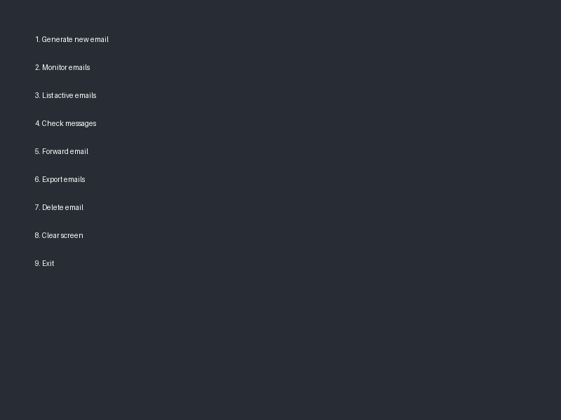

<div align="center">

# 📧 TempMail Manager (Encrypted)

[](https://creativecommons.org/licenses/by-nc/4.0/)
[](https://www.python.org/downloads/)
[](https://github.com/Sikandar-irfan/Temp-mail/issues)
[](https://github.com/Sikandar-irfan/Temp-mail/stargazers)

*A powerful and secure temporary email solution for your privacy needs - Encrypted Edition*

[Features](#-features) • 
[Installation](#-quick-start) • 
[Usage](#-usage) • 
[Security](#-security) • 
[License](#-license)



</div>

## ✨ Features

🔒 **Privacy First**
- Generate disposable email addresses instantly
- Protect your real email from spam and tracking
- Delete multiple emails after use

📱 **Smart Monitoring**
- Real-time email notifications
- Live inbox monitoring
- Quick message preview

🌐 **Multiple Providers**
- Support for Guerrilla Mail
- Integration with 1secmail
- Expandable provider system

🛠️ **Power Tools**
- Email forwarding capabilities
- Message backup and export
- Custom email address generation

🔐 **Enhanced Security**
- Fully encrypted application file
- Source code protection
- Auto-dependency installation

## 🚀 Quick Start

### Prerequisites
- Python 3.8 or higher
- pip package manager

### Installation

```bash
# Clone the repository
git clone https://github.com/Sikandar-irfan/Temp-mail.git

# Navigate to project directory
cd Temp-mail

# Run the encrypted application
python Temp-mail.py
```

## 💻 Usage

When you run the application, required dependencies will be automatically installed. Just run:

```bash
python Temp-mail.py
```

Follow the on-screen instructions to:
- Generate temporary email addresses
- Monitor for incoming messages
- Forward emails to other addresses
- Export and manage your temporary emails

## 🔒 Security

This version of TempMail Manager is distributed as an encrypted Python file to protect the intellectual property of the code while still allowing users to run the application. The encryption:

- Secures the source code from unauthorized viewing or modification
- Automatically installs necessary dependencies when run
- Provides the same functionality as the original version
- Requires no additional setup beyond running the Python file

### Email Forwarding

The Application supports the same email forwarding capabilities. To use Gmail forwarding:

1. Enable 2-Step Verification on your Google account
2. Generate an App Password for the application
3. Create a `.env` file with your SMTP credentials:

```
SMTP_HOST=smtp.gmail.com
SMTP_PORT=587
SMTP_USER=your.email@gmail.com
SMTP_PASS=xxxx xxxx xxxx xxxx
```

## 📜 License

This project is licensed under the Creative Commons Attribution-NonCommercial 4.0 International License.

**Key Points:**
- ✅ Free for personal use
- ✅ Must give attribution
- ❌ No commercial use allowed
- ✅ Modifications allowed

## 🌟 Support

Like this project? Please give it a star ⭐ to show your support!

## 📞 Contact

Sikandar Irfan
- GitHub: [@Sikandar-irfan](https://github.com/Sikandar-irfan)

---

<div align="center">
Made with ❤️ by Sikandar Irfan
</div>
