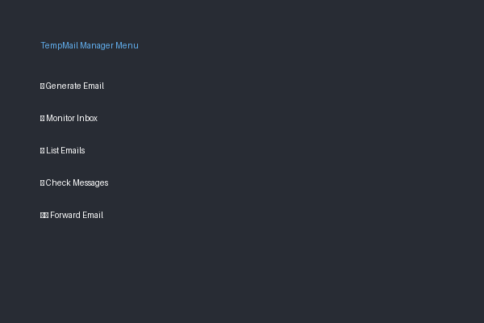

<div align="center">

# 📧 TempMail Manager

[](https://creativecommons.org/licenses/by-nc/4.0/)
[](https://www.python.org/downloads/)
[](https://github.com/Sikandar-irfan/Temp-mail/issues)
[](https://github.com/Sikandar-irfan/Temp-mail/stargazers)

*A powerful and secure temporary email solution for your privacy needs*

[Features](#-features) • 
[Installation](#-quick-start) • 
[Usage](#-usage) • 
[Examples](#-code-examples) • 
[Contributing](#-contributing) • 
[License](#-license)


</div>

## ✨ Features

🔒 **Privacy First**
- Generate disposable email addresses instantly
- Protect your real email from spam and tracking
- Delete multiple emails after use

📱 **Smart Monitoring**
- Real-time email notifications
- Live inbox monitoring
- Quick message preview

🌐 **Multiple Providers**
- Support for Guerrilla Mail
- Integration with 1secmail
- Expandable provider system

🛠️ **Power Tools**
- Email forwarding capabilities
- Message backup and export
- Custom email address generation

## 🚀 Quick Start

### Prerequisites
- Python 3.8 or higher
- pip package manager

### Installation

```bash
# Clone the repository
git clone https://github.com/Sikandar-irfan/Temp-mail.git

# Navigate to project directory
cd Temp-mail


```

## 💻 Usage

Start the application:
```bash
python cli.py
```

### Interactive Menu

<div align="center">

</div>

### Available Commands

| Command | Description |
|---------|-------------|
| 1️⃣ Generate | Create a new temporary email |
| 2️⃣ Monitor | Watch for incoming messages |
| 3️⃣ List | View all active emails |
| 4️⃣ Check | Read received messages |
| 5️⃣ Forward | Forward emails to another address |
| 6️⃣ Export | Save email data |
| 7️⃣ Delete | Remove email addresses |
| 8️⃣ Clear | Clear the screen |
| 9️⃣ Exit | Close the application |

## 📚 Code Examples

### Generate a New Email
```python
from temp_mail_manager import TempMailManager

manager = TempMailManager()
email = manager.generate_email()
print(f"Your temporary email: {email}")
```

### Monitor for New Messages
```python
def on_message(message):
    print(f"New message from: {message['from']}")
    print(f"Subject: {message['subject']}")

manager.monitor_email(email, callback=on_message)
```

## 📧 Email Forwarding Setup Guide

TempMail Manager allows you to forward emails to both temporary and external email addresses. Here's how to set it up:

### Setting up Gmail SMTP (RecommendedIf you are sending to external valid gmails)

#### Step 1: Enable 2-Step Verification (Required)

1. Go to your Google Account settings:
   - Visit [Google Account](https://myaccount.google.com)
   - Click on "Security" in the left sidebar

2. Find "2-Step Verification":
   - Scroll down to "Signing in to Google"
   - Click on "2-Step Verification"
   - Click "Get Started"

3. Follow Google's setup process:
   - Enter your password if prompted
   - Add your phone number
   - Choose how you want to receive codes (text message or phone call)
   - Enter the verification code you receive
   - Click "Turn On" to enable 2-Step Verification

#### Step 2: Generate App Password

**Note**: You can only access App Passwords after enabling 2-Step Verification!

1. Go to [Google Account Security](https://myaccount.google.com/security)
2. Scroll down to "Signing in to Google"
3. Click on "App Passwords" (If you don't see this option, 2-Step Verification is not enabled)
4. Enter your Google Account password if prompted
5. At the bottom, click:
   - Select app: Choose "Mail"
   - Select device: Choose "Other (Custom name)"
   - Enter "TempMail Manager" as the name
6. Click "Generate"
7. The app password is the 16-character code shown in the yellow bar
8. Copy this password (you won't be able to see it again!)

#### Step 3: Configure SMTP Settings

After getting your App Password, set up the SMTP configuration:

```bash
# For Linux/Mac - Add to ~/.bashrc or ~/.zshrc:
export SMTP_HOST=smtp.gmail.com
export SMTP_PORT=587
export SMTP_USER=your.email@gmail.com    # Your full Gmail address
export SMTP_PASS=xxxx xxxx xxxx xxxx     # Your 16-character App Password

# For Windows (Command Prompt) - Run these commands:
set SMTP_HOST=smtp.gmail.com
set SMTP_PORT=587
set SMTP_USER=your.email@gmail.com
set SMTP_PASS=xxxxxxxxxxxxxxxx

# For Windows (PowerShell):
$env:SMTP_HOST = "smtp.gmail.com"
$env:SMTP_PORT = "587"
$env:SMTP_USER = "your.email@gmail.com"
$env:SMTP_PASS = "xxxxxxxxxxxxxxxx"
```

#### Troubleshooting 2-Step Verification

1. **Can't find 2-Step Verification**:
   - Make sure you're signed in to your Google Account
   - Go directly to [2-Step Verification](https://myaccount.google.com/signinoptions/two-step-verification)
   - If still not visible, your account might not be eligible (e.g., managed by organization)

2. **Can't find App Passwords**:
   - Verify 2-Step Verification is enabled
   - Check if your account is managed by an organization (some features might be restricted)
   - Try accessing directly: [App Passwords](https://myaccount.google.com/apppasswords)

3. **App Password not working**:
   - Make sure you copied all 16 characters
   - Try generating a new App Password
   - Ensure you're using your Gmail address as SMTP_USER

#### Testing the Setup

After configuring SMTP settings, you can test it:

1. Using the CLI:
   ```bash
   python cli.py
   # Choose option 5 (Forward email)
   # Select your temporary email
   # Choose the message to forward
   # Select "External Email"
   # Enter your Gmail address
   ```

2. Using Python code:
   ```python
   from temp_mail_manager import TempMailManager
   
   manager = TempMailManager()
   result = manager.forward_email(
       'your_temp@sharklasers.com',
       'your.real@gmail.com',
       '1'
   )
   print(f"Forward result: {result}")
   ```

If you encounter any issues, check the application logs for detailed error messages.

### Using Other Email Providers

#### Outlook/Office 365
```bash
export SMTP_HOST=smtp.office365.com
export SMTP_PORT=587
export SMTP_USER=your.email@outlook.com
export SMTP_PASS=your_app_password
```

#### Yahoo Mail
```bash
export SMTP_HOST=smtp.mail.yahoo.com
export SMTP_PORT=587
export SMTP_USER=your.email@yahoo.com
export SMTP_PASS=your_app_password
```

### Troubleshooting

1. **Authentication Failed**:
   - Double-check your app password
   - Ensure 2-Step Verification is enabled
   - Try regenerating the app password

2. **Connection Error**:
   - Check your internet connection
   - Verify SMTP_HOST and SMTP_PORT are correct
   - Make sure your email provider hasn't blocked SMTP access

3. **Email Not Received**:
   - Check spam/junk folder
   - Verify the recipient email address
   - Ensure your email provider allows SMTP forwarding

## 🤝 Contributing

We welcome contributions! Here's how you can help:

1. Fork the repository
2. Create your feature branch:
   ```bash
   git checkout -b feature/AmazingFeature
   ```
3. Commit your changes:
   ```bash
   git commit -m 'Add some AmazingFeature'
   ```
4. Push to the branch:
   ```bash
   git push origin feature/AmazingFeature
   ```
5. Open a Pull Request

## 📜 License

This project is licensed under the Creative Commons Attribution-NonCommercial 4.0 International License.

**Key Points:**
- ✅ Free for personal use
- ✅ Must give attribution
- ❌ No commercial use allowed
- ✅ Modifications allowed

## 🌟 Support

Like this project? Please give it a star ⭐ to show your support!

## 📞 Contact

Sikandar Irfan
- GitHub: [@Sikandar-irfan](https://github.com/Sikandar-irfan)

---

<div align="center">
Made with ❤️ by Sikandar Irfan
</div>
